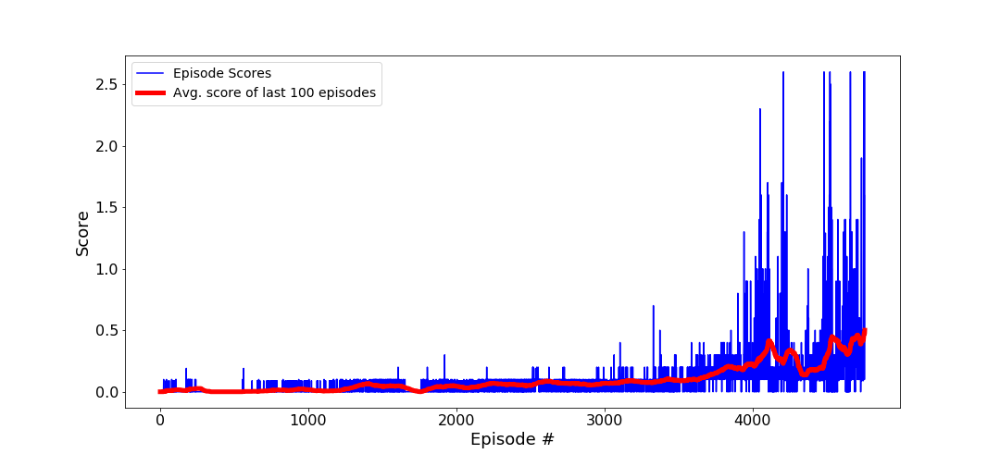
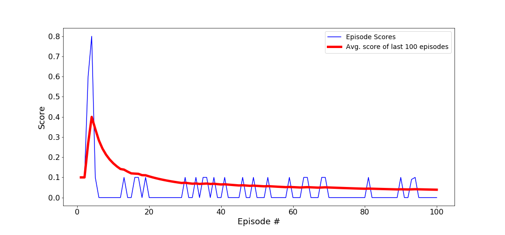

# Project report

## Introduction

The goal of this project is to train two agents to control two rackets and keep a ball in play for as long as possible. If an agent hits the ball over the net, it receives a reward of +0.1.  If an agent lets a ball hit the ground or hits the ball out of bounds, it receives a reward of -0.01.  Thus, the goal of each agent is to keep the ball in play.

The task is episodic, and in order to solve the environment, your agents must get an average score of +0.5 (over 100 consecutive episodes, after taking the maximum over both agents). Specifically,

- After each episode, we add up the rewards that each agent received (without discounting), to get a score for each agent. This yields 2 (potentially different) scores. We then take the maximum of these 2 scores.
- This yields a single **score** for each episode.

The environment is considered solved, when the average (over 100 episodes) of those **scores** is at least +0.5.


## Environment

The observation space consists of 8 variables corresponding to the position and velocity of the ball and racket. Each agent receives its own, local observation.  Two continuous actions are available, corresponding to movement toward (or away from) the net, and jumping. 

```
INFO:unityagents:
'Academy' started successfully!
Unity Academy name: Academy
        Number of Brains: 1
        Number of External Brains : 1
        Lesson number : 0
        Reset Parameters :
		
Unity brain name: TennisBrain
        Number of Visual Observations (per agent): 0
        Vector Observation space type: continuous
        Vector Observation space size (per agent): 8
        Number of stacked Vector Observation: 3
        Vector Action space type: continuous
        Vector Action space size (per agent): 2
        Vector Action descriptions: , 
```


## Agent Training

### MADDPG architecture

Having already worked with the DDPG architecture in the previous lesson and being a little hard pressed for time, I decided to continue with a Multi Agent Deep Deterministic Policy Gradients (MADDPG 1) Network. The only difference here is each agent is modeled as a Deep Deterministic Policy Gradient (DDPG2) agent which learn from shared experiences to expedite the process. This sharing is accomplished using an actor-critic approach as described below:
 - For each agent, the actor receives as input the individual state (observations) of the agent and output a (two-dimensional) action. 
 - The critic model of each actor, receives the states and actions of *ALL* actors concatenated. 
 
Throughout training the agents also use a common experience replay buffer but draw independant samples. 

The final network had the following layers for both actor and critic:
- Fully connected layer - input: 87 (state size) output: 256
+ Batchnormalisation 
- Fully connected layer - input: 256 output 256
- Fully connected layer - input: 256 output: 2 (action size)

As can be seen I used much the same architecture from my previous project. I kept all the optimisations I had found during that project:
- batch normalization between first and second hidden layer
- setting the weights of local and target actor, respectively, local and target critic to the same
values at initialization time 

Hyperparameters.
In terms of hyperparameters I did a fair bit of experimenting. Here are the nal choices and some
observations. For the learning rates I chose 10-4 for the actors and 10-3 for the critics. Larger
learning rates did not seem to work or give signicant speed ups. The optimizer was Adam in all
cases.


Parameters used:

- Maximum steps per episode: 1000
- replay buffer size       : 10000 
- minibatch size           : 256
- discount factor          : 0.99            
- TAU                      : 1e-3
- actor learning rate      : 1e-4
- critic learning rate     : 1e-3 

### Training Results

```
-----Training for 6000 episodes using a 256x256 architecture-----
Episode 100	Average Score: 0.015
Episode 200	Average Score: 0.019
Episode 300	Average Score: 0.010
Episode 400	Average Score: 0.000
Episode 500	Average Score: 0.000
Episode 600	Average Score: 0.003
Episode 700	Average Score: 0.007
Episode 800	Average Score: 0.014
Episode 900	Average Score: 0.014
Episode 1000	Average Score: 0.018
Episode 1100	Average Score: 0.006
Episode 1200	Average Score: 0.011
Episode 1300	Average Score: 0.034
Episode 1400	Average Score: 0.065
Episode 1500	Average Score: 0.045
Episode 1600	Average Score: 0.047
Episode 1700	Average Score: 0.014
Episode 1800	Average Score: 0.015
Episode 1900	Average Score: 0.042
Episode 2000	Average Score: 0.044
Episode 2100	Average Score: 0.039
Episode 2200	Average Score: 0.057
Episode 2300	Average Score: 0.065
Episode 2400	Average Score: 0.057
Episode 2500	Average Score: 0.053
Episode 2600	Average Score: 0.084
Episode 2700	Average Score: 0.071
Episode 2800	Average Score: 0.067
Episode 2900	Average Score: 0.056
Episode 3000	Average Score: 0.068
Episode 3100	Average Score: 0.074
Episode 3200	Average Score: 0.089
Episode 3300	Average Score: 0.075
Episode 3400	Average Score: 0.093
Episode 3500	Average Score: 0.092
Episode 3600	Average Score: 0.102
Episode 3700	Average Score: 0.130
Episode 3800	Average Score: 0.178
Episode 3900	Average Score: 0.193
Episode 4000	Average Score: 0.220
Episode 4100	Average Score: 0.358
Episode 4200	Average Score: 0.262
Episode 4300	Average Score: 0.258
Episode 4400	Average Score: 0.183
Episode 4500	Average Score: 0.280
Episode 4600	Average Score: 0.364
Episode 4700	Average Score: 0.440
Episode 4757	Average Score: 0.500
Environment solved in 4757 episodes!	Average Score: 0.500
```

|  |
|:--:| 
| Plot of average scores across entire training period using a 8x256x256x2 architecture |


### Trained agent

The following checkpoints were created for one such solution:
1. Player 1 :
 - checkpoint_actor_agent_0.pth
 - checkpoint_critic_agent_0.pth
2. Player 2 "
 - checkpoint_actor_agent_1.pth
 - checkpoint_critic_agent_1.pth

|  |
|:--:| 
| Plot of average scores across entire training period using a 33x256x256x4 architecture |

## Ideas for future work

One of the most obvious directions for additional research is to experiment with other models, particularly Proximal Policy Optimization (PPO) on this task. It lends itself to low-dimensional problem such as this. But even within this model, further experimenting needs to be done with
- experience replay, optimized sampling could speed up learning.
- choice and decay of noise introduced through-out training. Look for optimisations in initializing and gradually reducing the noise
